# lir

Fast Largest Interior Rectangle calculation within a binary grid.

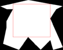  

:rocket: Through [Numba](https://github.com/numba/numba) the Python code is compiled to machine code for execution at native machine code speed!

## Installation

```bash
pip install largestinteriorrectangle
```

## Usage

```python
import largestinteriorrectangle as lir
import numpy as np

grid = np.array([[0, 0, 1, 0, 0, 0, 0, 0, 0],
                 [0, 0, 1, 0, 1, 1, 0, 0, 0],
                 [0, 0, 1, 1, 1, 1, 1, 0, 0],
                 [0, 0, 1, 1, 1, 1, 1, 1, 0],
                 [0, 0, 1, 1, 1, 1, 1, 1, 0],
                 [0, 1, 1, 1, 1, 1, 1, 0, 0],
                 [0, 0, 1, 1, 1, 1, 0, 0, 0],
                 [0, 0, 1, 1, 1, 1, 0, 0, 0],
                 [1, 1, 1, 1, 1, 1, 0, 0, 0],
                 [1, 1, 0, 0, 0, 1, 1, 1, 1],
                 [0, 0, 0, 0, 0, 0, 0, 0, 0]],
                "bool")

lir.lir(grid) # array([2, 2, 4, 7])
```

For [significant performance enhancement](#lir-based-on-contour) in larger grids specify the contours(s) of the polygons to consider.
If the grid only has one polygon like in the example the contour can be obtained as so (with [opencv](https://pypi.org/project/opencv-python/)).

```python
import cv2 as cv
cv_grid = grid.astype("uint8") * 255
contours, _ = \
    cv.findContours(cv_grid, cv.RETR_TREE, cv.CHAIN_APPROX_NONE)
contour = contours[0][:, 0, :]
```

then calculate the rectangle.

```python
lir.lir(grid, contour) # array([2, 2, 4, 7])
```

## Contributing

Pull requests are welcome. For major changes, please open an issue first to discuss what you would like to change.

Please make sure to update tests as appropriate.

Run tests using

```bash
python -m unittest
```

## License

[Apache License 2.0](https://github.com/lukasalexanderweber/lir/blob/main/LICENSE)

## Acknowledgements

Thanks to [Tim Swan](https://www.linkedin.com/in/tim-swan-14b1b/) for making his Largest Interior Rectangle implementation in C# [open source](https://github.com/Evryway/lir) and did a great [blog post](https://www.evryway.com/largest-interior/) about it. The first part was mainly reimplementing his solution in Python.

The used Algorithm was described 2019 in [Algorithm for finding the largest inscribed rectangle in polygon](https://journals.ut.ac.ir/article_71280_2a21de484e568a9e396458a5930ca06a.pdf) by [Zahraa Marzeh, Maryam Tahmasbi and Narges Mireh](https://journals.ut.ac.ir/article_71280.html).

Thanks also to [Mark Setchell](https://stackoverflow.com/users/2836621/mark-setchell) and [joni](https://stackoverflow.com/users/4745529/joni) who greatly helped optimizing the performance using cpython/numba in [this SO querstion](https://stackoverflow.com/questions/69854335/optimize-the-calculation-of-horizontal-and-vertical-adjacency-using-numpy)

## How it works

For a binary grid:

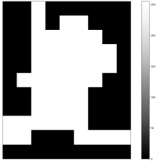

We can specify for each cell how far one can go to the right and to the bottom:

Horizontal Adjacency             |  Vertical Adjacency
:-------------------------:|:-------------------------:
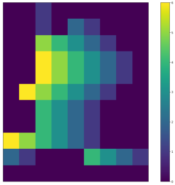 | 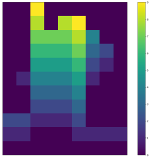

Now the goal is to find the possible rectangles for each cell. For that, we can specify a Horizontal Vector based on the Horizontal Adjacency and Vertical Vector based on the Vertical Adjacency:

Horizontal Vector (2,2)             |  Vertical Vector (2,2)
:-------------------------:|:-------------------------:
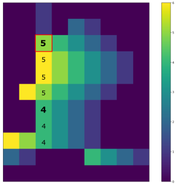 | 

So at the given cell (2,2) the Horizontal Vector is (5,4) and the Vertical Vector is (7,4).

Reversing either vector lets you create the spans by stacking the vectors, so for example reversing the Vertical Vector to (4,7) gives a set of spans of (5 by 4) and (4 by 7).

Since `4*7=28 > 5*4=20` a rectangle with width 4 and height 7 is the biggest possible rectangle for cell (2,2).
The width and height is stored in a span map, where the widths and heights of the maximum rectangles are stored for all cells.
Using the area we can identify the biggest rectangle at (2, 2) with width 4 and height 7.

Widths             |  Heights             |  Areas
:-------------------------:|:-------------------------:|:-------------------------:
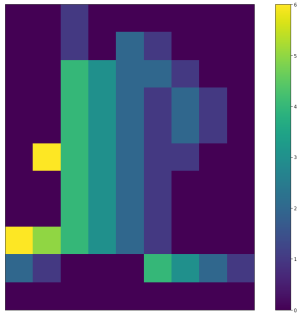 | 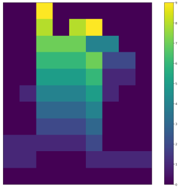 | 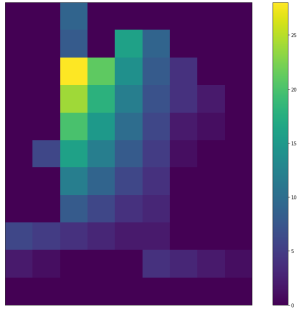

------------

## LIR based on contour

Especially for bigger grids the functionality can be further optimized by only analysing the outline of a polygon. Here are timings created by calculating the lir for [masks in different resolutions](https://github.com/lukasalexanderweber/lir/tree/main/ext/performance_comparison):

Timings             |  Timings (log transformed)
:-------------------------:|:-------------------------:
 | 

The computation costs are saved by analysing only the contour pixels instead of all cells. We utilize the fact that the LIR always touches the outline of the polygon. Here is how it works:

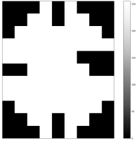

An outline cell can span into one (blue), two (green) or three (red) directions (up, down, left, right):

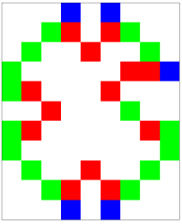

By calculating the spans in all possible directions we can obtain a span map:

Widths             |  Heights             |  Areas
:-------------------------:|:-------------------------:|:-------------------------:
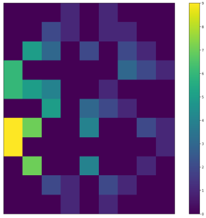 | 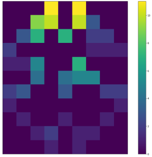 | 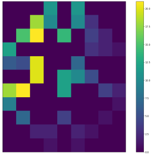

To analyse what happens here we'll have a closer look at cell (4,2).

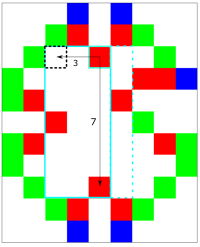

It can span into 3 directions: left, down and right. Going to left and down the maximum span is (3 by 7). The final spans are noted in left2right and top2bottom notation. In this case, however, the width is calculated from right2left. We can transform it with the simple formula `x = cell_x - span_width + 1`, in this case `4 - 3 + 1 = 2`. Since the height is already calculated from top2bottom y doesn't change and the span (3 by 7) is allocated to cell (2,2) (black dotted).

(2,2) is (besides (1,6)) the cell with the biggest area in the span map. However, the information that the rectangle can be expanded to the right (turquoise dotted) is missing.

So for "candidate cells" like (2,2) which do not lie on the outline and come from outline cells going in 3 directions, we create a new span map (using left2right and top2bottom adjacencies):


Widths             |  Heights             |  Areas
:-------------------------:|:-------------------------:|:-------------------------:
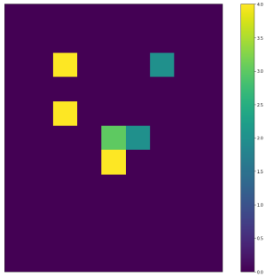 | 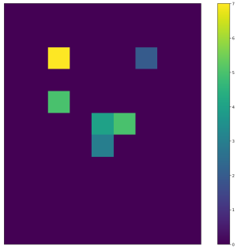 | 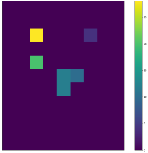

The biggest span of the two span maps are compared and the bigger one returned as lir, in this case cell (2,2) with a span (4 by 7)
